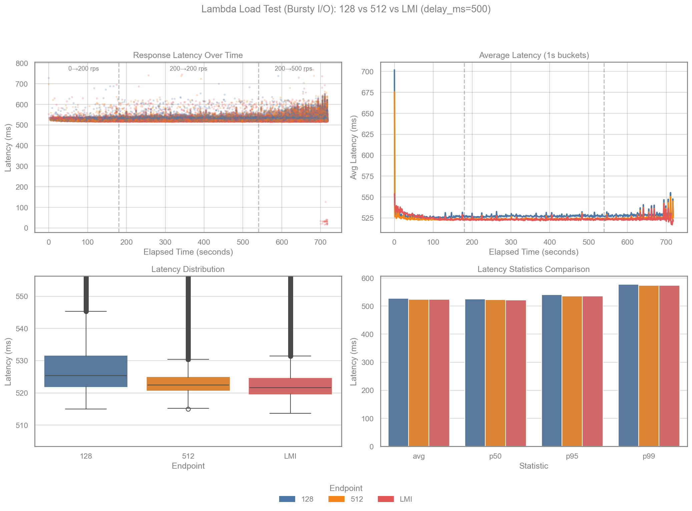
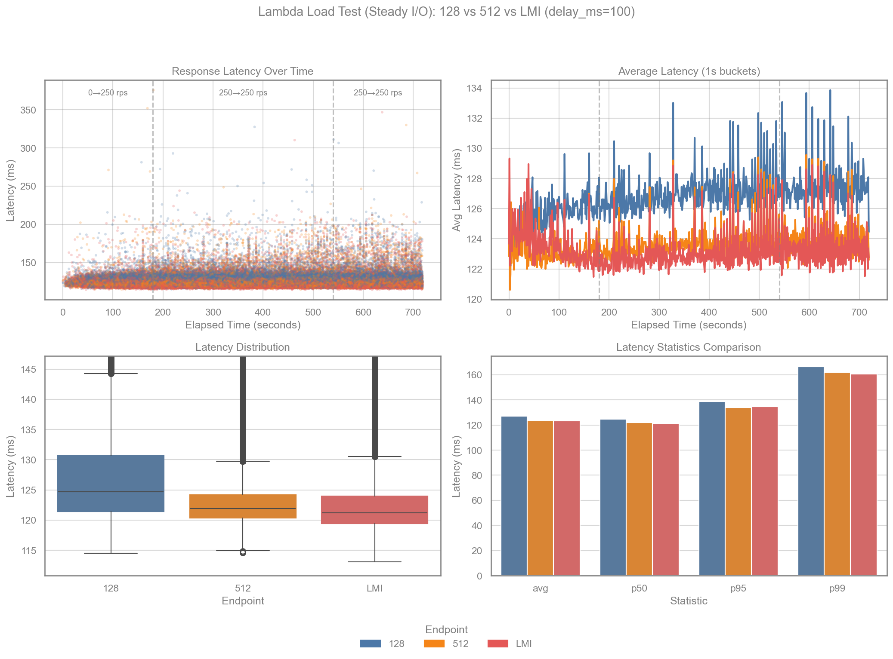
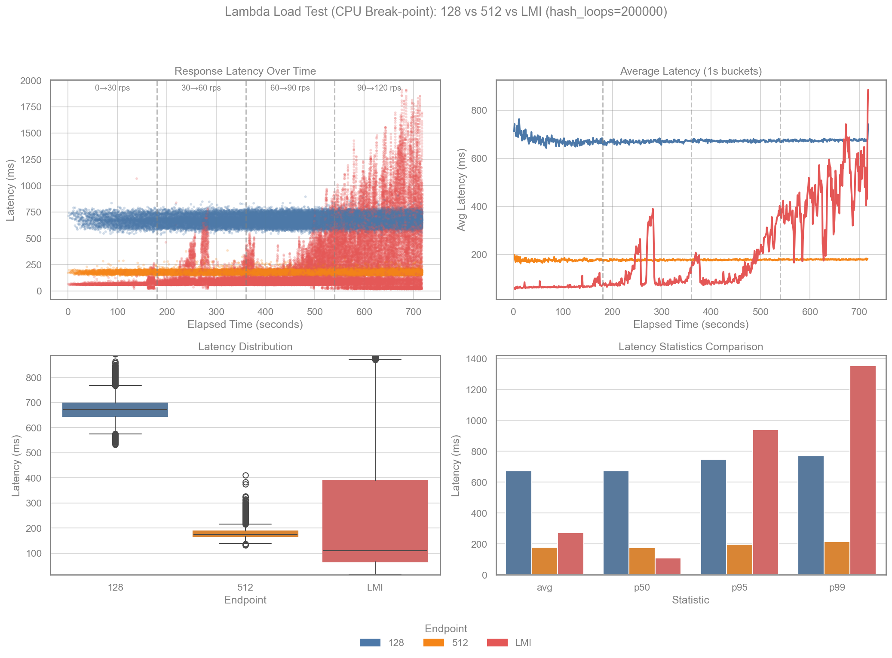
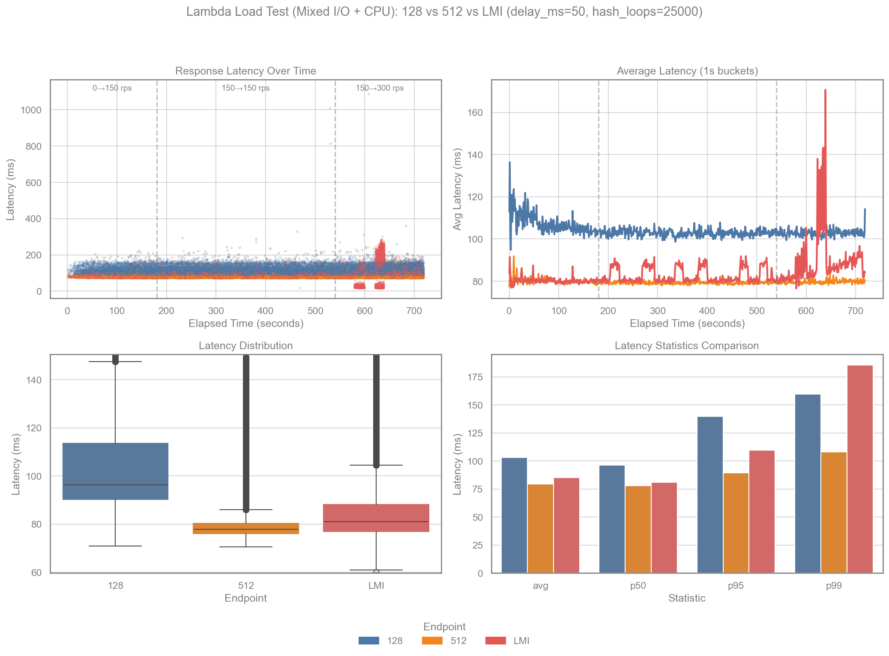
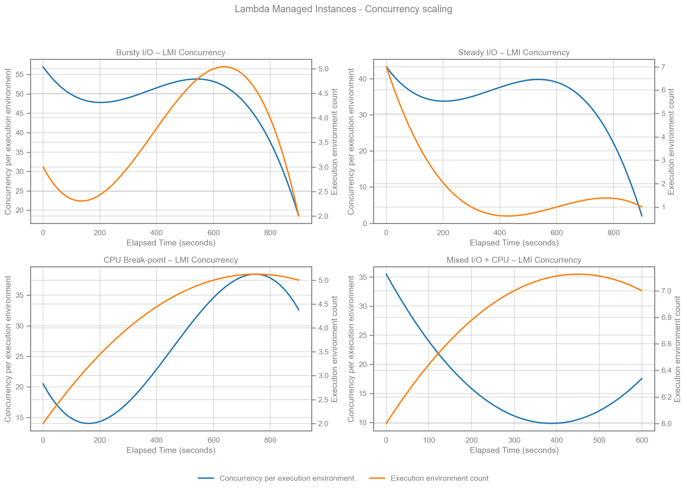

# Rust Lambda Managed Instances (LMI) Demo


A demonstration comparing AWS Lambda with standard execution vs Lambda Managed Instances (LMI) capacity provider, using a Rust-based serverless application.

## Overview

This project deploys three Rust Lambda functions behind API Gateway:

| Endpoint | Memory | Capacity Provider | Description |
|----------|--------|-------------------|-------------|
| `/default/128/hello` | 128 MB | Standard Lambda | Low-memory baseline |
| `/default/512/hello` | 512 MB | Standard Lambda | Modest CPU baseline |
| `/lmi/2048/hello` | 2048 MB | LMI | Lambda Managed Instances with concurrent execution |

The LMI function uses a [forked aws-lambda-rust-runtime](https://github.com/alessandrobologna/aws-lambda-rust-runtime/tree/feat/concurrent-lambda-runtime) that supports handling multiple concurrent requests within a single execution environment.


### LMI Configuration

The LMI Lambda is configured with:
- `ExecutionEnvironmentMemoryGiBPerVCpu: 2` - Memory per vCPU ratio
- `PerExecutionEnvironmentMaxConcurrency: 64` - Up to 64 concurrent requests per execution environment
- Capacity provider instance type: `c8g.xlarge` (arm64)
- Capacity provider subnets: 2 (the first two IDs from `ManagedInstancesSubnetIds`)
- Capacity provider baseline during tests: 2 instances (scale-in target)

## Prerequisites

- [AWS SAM CLI](https://docs.aws.amazon.com/serverless-application-model/latest/developerguide/install-sam-cli.html)
- [Rust](https://rustup.rs/) with [cargo-lambda](https://github.com/cargo-lambda/cargo-lambda)
- [k6](https://k6.io/docs/get-started/installation/) for load testing
- [uv](https://docs.astral.sh/uv/) for running the benchmark script
- AWS account with VPC subnets and security group for LMI

## Deployment

```bash
sam build
sam deploy --guided
```

You'll be prompted for:
- `ManagedInstancesSubnetIds` - VPC subnet IDs for LMI capacity provider
- `ManagedInstancesSecurityGroupId` - Security group ID for LMI

## Load Testing

Run the benchmark to execute all scenarios. Each scenario compares all three endpoints (`/default/128/hello`, `/default/512/hello`, `/lmi/2048/hello`).

```bash
uv run benchmark.py --stack rust-lmi-demo --scenario all
```

By default, when running `--scenario all`, the script waits between scenarios until the LMI capacity provider scales back to its pre-run EC2 instance count (so each scenario starts from a comparable baseline). Disable with `--no-wait-for-scale-in`.

### Scenarios

| Scenario | `--scenario` | Workload | Default rate stages (rps) |
|----------|--------------|----------|---------------------------|
| Bursty I/O | `bursty-io` | `delay_ms=500` | `0→200` (3m), `200` (6m), `200→500` (3m) |
| Steady I/O | `steady-io` | `delay_ms=100` | `0→250` (3m), `250` (6m), `250` (3m) |
| CPU Break‑point | `cpu-break` | `hash_loops=200000` | `0→30` (3m), `30→60` (3m), `60→90` (3m), `90→120` (3m) |
| Mixed I/O + CPU | `mixed` | `delay_ms=50`, `hash_loops=25000` | `0→150` (3m), `150` (6m), `150→300` (3m) |

### Phases (arrival-rate stages)

The benchmark uses per-endpoint k6 scenarios with the `ramping-arrival-rate` executor so each endpoint sees the same target request rate.
Stage targets are **requests per second (rps)** and apply per endpoint; peak aggregate rps is roughly `target × endpoints`.
This avoids slower endpoints throttling load against faster ones.

You can override stages with `--stage-targets` (single duration repeated for each target) or `--stages-json` (full control).

### Options

| Option | Default | Description |
|--------|---------|-------------|
| `--stack` | (required) | CloudFormation stack name |
| `--region` | AWS default | AWS region |
| `--duration` | 30s | Duration per k6 stage (only used with `--stage-targets`) |
| `--stage-targets` | (none) | Comma-separated arrival‑rate targets (rps), e.g. `20,20,40` |
| `--stages-json` | (none) | Full k6 stages JSON (advanced) |
| `--scenario` | all | `bursty-io`, `steady-io`, `cpu-break`, `mixed`, or `all` |
| `--cpu-break-hash-loops` | 200000 | `hash_loops` used for the CPU break‑point scenario (max 1,000,000) |
| `--steady-io-delay-ms` | 100 | `delay_ms` used for the Steady I/O scenario (max 15,000) |
| `--bursty-io-delay-ms` | 500 | `delay_ms` used for the Bursty I/O scenario (max 15,000) |
| `--mixed-delay-ms` | 50 | `delay_ms` used for the Mixed scenario (max 15,000) |
| `--mixed-hash-loops` | 25000 | `hash_loops` used for the Mixed scenario (max 1,000,000) |
| `--output-dir` | `./benchmark-results` | Directory for results |
| `--skip-test` | false | Regenerate charts from existing CSV |
| `--wait-for-scale-in/--no-wait-for-scale-in` | (auto) | Wait between scenarios for LMI scale-in (defaults to on for `--scenario all`) |
| `--capacity-provider-arn` | (derived) | Capacity provider ARN used to find EC2 instances for the wait loop |
| `--scale-in-check-seconds` | 60 | How often to check instance count while waiting |
| `--scale-in-max-minutes` | 90 | Max time to wait for scale-in between scenarios |
| `--cloudwatch-concurrency/--no-cloudwatch-concurrency` | false | Fetch and plot LMI `ExecutionEnvironmentConcurrency` (Average + SampleCount) for each scenario window |
| `--cloudwatch-period-seconds` | 300 | Period (seconds) for CloudWatch concurrency queries |
| `--cloudwatch-function-name` | (derived) | Override CloudWatch FunctionName dimension (default `<stack>-lmi`) |
| `--cloudwatch-resource` | (derived) | Override CloudWatch Resource dimension (default `<function>:$LATEST.PUBLISHED`) |
| `--cloudwatch-capacity-provider-name` | (derived) | Override CloudWatch CapacityProviderName dimension (default `<stack>-cp-2-c8xlarge`) |
| `--refresh-cloudwatch` | false | Re-fetch CloudWatch concurrency data even if cached CSVs exist (useful with `--skip-test`) |

## Results

### Benchmark Output

The benchmark writes one CSV + one chart per scenario to `benchmark-results/`.

Example outputs after a run:
- `benchmark-results/k6-<scenario>-<timestamp>.csv`
- `benchmark-results/benchmark-<scenario>-<timestamp>.png`

If `--cloudwatch-concurrency` is enabled, the script also writes CloudWatch concurrency charts:
- For a single scenario run: `benchmark-results/cloudwatch-concurrency-<scenario>-<timestamp>.png`
- For `--scenario all`: a combined 2×2 PNG at `benchmark-results/cloudwatch-concurrency-all-<timestamp>.png`
It also saves the raw CloudWatch series so charts can be regenerated later:
- `benchmark-results/cloudwatch-concurrency-<scenario>-<timestamp>.csv` (used automatically when replotting with `--skip-test`)

When documenting results, note the client machine (instance type + region) because it can affect tail latency under high rates.

### Results (2025‑12‑26, m7g.medium in us‑east‑1)

#### Bursty I/O (`delay_ms=500`, target 200→500 rps)
| Endpoint | Avg (ms) | p95 (ms) | p99 (ms) | 5xx (count) | 5xx (%) |
|----------|---------:|---------:|---------:|------------:|--------:|
| 128 | 528.0 | 540.2 | 578.1 | 0 | 0.00% |
| 512 | 524.6 | 535.6 | 573.5 | 0 | 0.00% |
| LMI | 523.7 | 536.0 | 573.6 | 82 | 0.05% |

#### Steady I/O (`delay_ms=100`, steady 250 rps)
| Endpoint | Avg (ms) | p95 (ms) | p99 (ms) | 5xx (count) | 5xx (%) |
|----------|---------:|---------:|---------:|------------:|--------:|
| 128 | 127.0 | 138.7 | 166.6 | 0 | 0.00% |
| 512 | 123.7 | 134.0 | 162.0 | 0 | 0.00% |
| LMI | 123.2 | 134.5 | 160.7 | 0 | 0.00% |

#### CPU Break‑point (`hash_loops=200000`, 30→120 rps)
| Endpoint | Avg (ms) | p95 (ms) | p99 (ms) | 5xx (count) | 5xx (%) |
|----------|---------:|---------:|---------:|------------:|--------:|
| 128 | 672.2 | 748.3 | 770.8 | 0 | 0.00% |
| 512 | 177.7 | 198.3 | 213.2 | 0 | 0.00% |
| LMI | 272.3 | 940.2 | 1352.6 | 2526 | 5.85% |

#### Mixed I/O + CPU (`delay_ms=50`, `hash_loops=25000`, 150→300 rps)
| Endpoint | Avg (ms) | p95 (ms) | p99 (ms) | 5xx (count) | 5xx (%) |
|----------|---------:|---------:|---------:|------------:|--------:|
| 128 | 103.2 | 140.0 | 159.8 | 0 | 0.00% |
| 512 | 79.5 | 89.5 | 108.0 | 0 | 0.00% |
| LMI | 85.1 | 109.6 | 185.8 | 2065 | 1.91% |

#### Key Observations

- **Steady I/O:** All three are stable. 512 and LMI are essentially tied on tail latency; 128 is consistently slower.
- **Bursty I/O:** Latency stays similar across endpoints, but LMI shows a small 5xx rate during the spike (0.05%), while standard Lambdas remain clean.
- **CPU break‑point:** LMI shows 5xx even in the first stage and becomes worse than 512 by **~60 rps**, then degrades sharply at 120 rps (p95 > 1s, 5.85% 5xx). This is the clearest break‑point where a modest 512 MB standard Lambda outperforms LMI for CPU‑bound work.
- **Mixed:** LMI stays close to 512 at low rate, but tail latency and 5xx rise in the final ramp (stage 3 p99 ≈ 227 ms, 5.1% 5xx), while 512 remains stable.

#### Charts









### LMI Concurrency Scaling (CloudWatch)

The combined chart overlays:
- `ExecutionEnvironmentConcurrency` (Average) as “Concurrency per execution environment”
- `SampleCount` as a proxy for the number of execution environments reporting during the period
Left y‑axis is concurrency per execution environment; right y‑axis is execution environment count.
The combined 2×2 chart is saved as `benchmark-results/cloudwatch-concurrency-all-<timestamp>.png`.
If CloudWatch metrics are delayed, you can rerun just the charting step a few minutes later:
`uv run benchmark.py --stack <stack> --scenario all --skip-test --cloudwatch-concurrency --refresh-cloudwatch --region <region>`

Charts use the same elapsed‑time axis as the k6 plots and apply spline interpolation for readability only. With a 5‑minute CloudWatch period and 12‑minute tests, the chart has few points; use it as a coarse indicator of scale‑out rather than a precise per‑second trace.



### Notes

- CPU-heavy work does not benefit from high per-environment concurrency. With `ExecutionEnvironmentMemoryGiBPerVCpu: 2` and a 2 GB function, each execution environment gets ~1 vCPU; allowing up to `PerExecutionEnvironmentMaxConcurrency: 64` means CPU-bound requests contend for that vCPU.
- The current LMI capacity provider config leaves limited horizontal headroom: `MaxVCpuCount: 12` with `c8g.xlarge` (4 vCPU each) caps at 3 instances, and `MaxExecutionEnvironments: 4` further limits scale-out. This makes 5xx under bursty or CPU-heavy load more likely in these tests.
- Lambda managed instances capacity providers scale gradually; AWS docs say they maintain enough headroom for traffic to double within 5 minutes. If traffic increases faster than this, requests can be throttled. ([AWS docs](https://docs.aws.amazon.com/lambda/latest/dg/lambda-managed-instances-scaling.html))
- If you don’t wait for LMI scale-in between scenarios, later scenarios will start from a pre-scaled capacity provider and won’t show scale-up/backlog behavior from idle. The benchmark can wait automatically when running `--scenario all` (disable with `--no-wait-for-scale-in`).
- The latency scatter plot is downsampled and the points are shuffled (per endpoint) to reduce overdraw; the CSV contains the full dataset.

## Project Structure

```
rust-lmi-demo/
├── src/main.rs           # Lambda handler
├── Cargo.toml            # Dependencies (uses forked runtime)
├── Cargo.lock            # Cargo lockfile
├── template.yaml         # SAM template
├── loadtest.js           # k6 load test script
├── benchmark.py          # Python orchestration + charting
└── benchmark-results/    # CSV data and PNG charts
```

## How It Works

### Standard Lambda
Each request gets its own Lambda invocation. Under load, AWS scales by creating more execution environments.

### LMI with Concurrent Runtime
The LMI capacity provider, combined with the concurrent Rust runtime, allows a single execution environment to handle multiple requests simultaneously using Tokio's async runtime. This reduces:
- Cold start frequency (fewer environments needed)
- Per-request overhead
- Total Lambda invocations under load

## Cleanup

```bash
sam delete --stack-name rust-lmi-demo
```

## License

MIT
