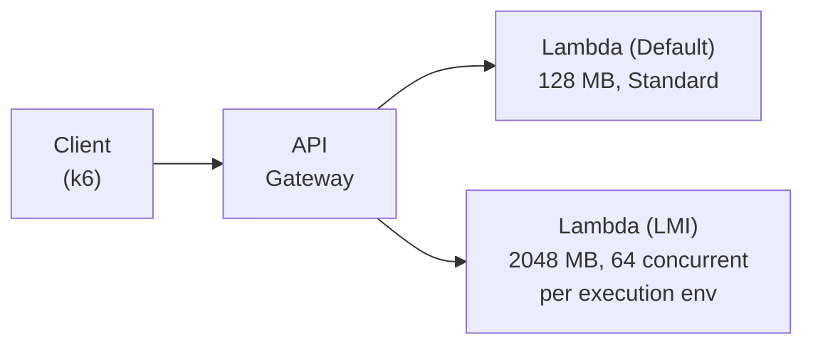
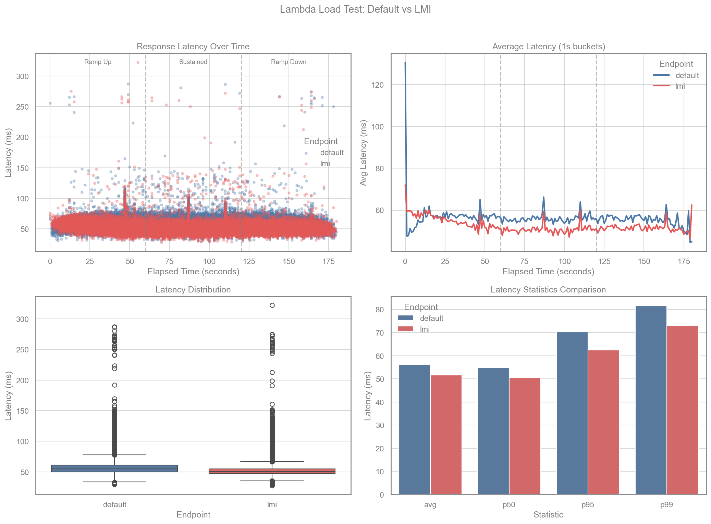

# Rust Lambda Managed Instances (LMI) Demo

A demonstration comparing AWS Lambda with standard execution vs Lambda Managed Instances (LMI) capacity provider, using a Rust-based serverless application.

## Overview

This project deploys two identical Rust Lambda functions behind API Gateway:

| Endpoint | Memory | Capacity Provider | Description |
|----------|--------|-------------------|-------------|
| `/default/hello` | 128 MB | Standard Lambda | Traditional Lambda execution model |
| `/lmi/hello/` | 2048 MB | LMI | Lambda Managed Instances with concurrent execution |

The LMI function uses a [forked aws-lambda-rust-runtime](https://github.com/alessandrobologna/aws-lambda-rust-runtime/tree/feat/concurrent-lambda-runtime) that supports handling multiple concurrent requests within a single execution environment.

## Architecture



### LMI Configuration

The LMI Lambda is configured with:
- `ExecutionEnvironmentMemoryGiBPerVCpu: 2` - Memory per vCPU ratio
- `PerExecutionEnvironmentMaxConcurrency: 64` - Up to 64 concurrent requests per execution environment

## Prerequisites

- [AWS SAM CLI](https://docs.aws.amazon.com/serverless-application-model/latest/developerguide/install-sam-cli.html)
- [Rust](https://rustup.rs/) with [cargo-lambda](https://github.com/cargo-lambda/cargo-lambda)
- [k6](https://k6.io/docs/get-started/installation/) for load testing
- [uv](https://docs.astral.sh/uv/) for running the benchmark script
- AWS account with VPC subnets and security group for LMI

## Deployment

```bash
sam build
sam deploy --guided
```

You'll be prompted for:
- `ManagedInstancesSubnetIds` - VPC subnet IDs for LMI capacity provider
- `ManagedInstancesSecurityGroupId` - Security group ID for LMI

## Load Testing

Run the benchmark to compare both endpoints:

```bash
uv run benchmark.py --stack rust-lmi-demo --vus 100 --duration 60s
```

### Options

| Option | Default | Description |
|--------|---------|-------------|
| `--stack` | (required) | CloudFormation stack name |
| `--region` | AWS default | AWS region |
| `--vus` | 50 | Number of virtual users at peak |
| `--duration` | 30s | Duration per phase (ramp up, sustain, ramp down) |
| `--output-dir` | `./benchmark-results` | Directory for results |
| `--skip-test` | false | Regenerate charts from existing CSV |

## Results

### Sample Benchmark (100 VUs, 60s per phase)

```
Metric                    Default          LMI       Diff
--------------------------------------------------------
Requests                    57773        57773
Avg Latency (ms)             56.2         51.6      -8.2%
Min Latency (ms)             29.7         27.8      -6.7%
p50 Latency (ms)             54.9         50.6      -7.7%
p90 Latency (ms)             66.8         59.4     -11.0%
p95 Latency (ms)             70.3         62.4     -11.2%
p99 Latency (ms)             81.6         73.1     -10.4%
Max Latency (ms)            287.1        322.2     +12.2%
--------------------------------------------------------
```

### Benchmark Chart



### Key Observations

- **Lower latency**: LMI shows 8-11% improvement across percentiles
- **More consistent**: Tighter distribution at p90/p95/p99
- **Same throughput**: Both endpoints handle identical request counts

## Project Structure

```
rust-lmi-demo/
├── rust_app/
│   ├── src/main.rs       # Lambda handler
│   └── Cargo.toml        # Dependencies (uses forked runtime)
├── template.yaml         # SAM template
├── loadtest.js           # k6 load test script
├── benchmark.py          # Python orchestration + charting
└── benchmark-results/    # CSV data and PNG charts
```

## How It Works

### Standard Lambda
Each request gets its own Lambda invocation. Under load, AWS scales by creating more execution environments.

### LMI with Concurrent Runtime
The LMI capacity provider, combined with the concurrent Rust runtime, allows a single execution environment to handle multiple requests simultaneously using Tokio's async runtime. This reduces:
- Cold start frequency (fewer environments needed)
- Per-request overhead
- Total Lambda invocations under load

## Cleanup

```bash
sam delete --stack-name rust-lmi-demo
```

## License

MIT
