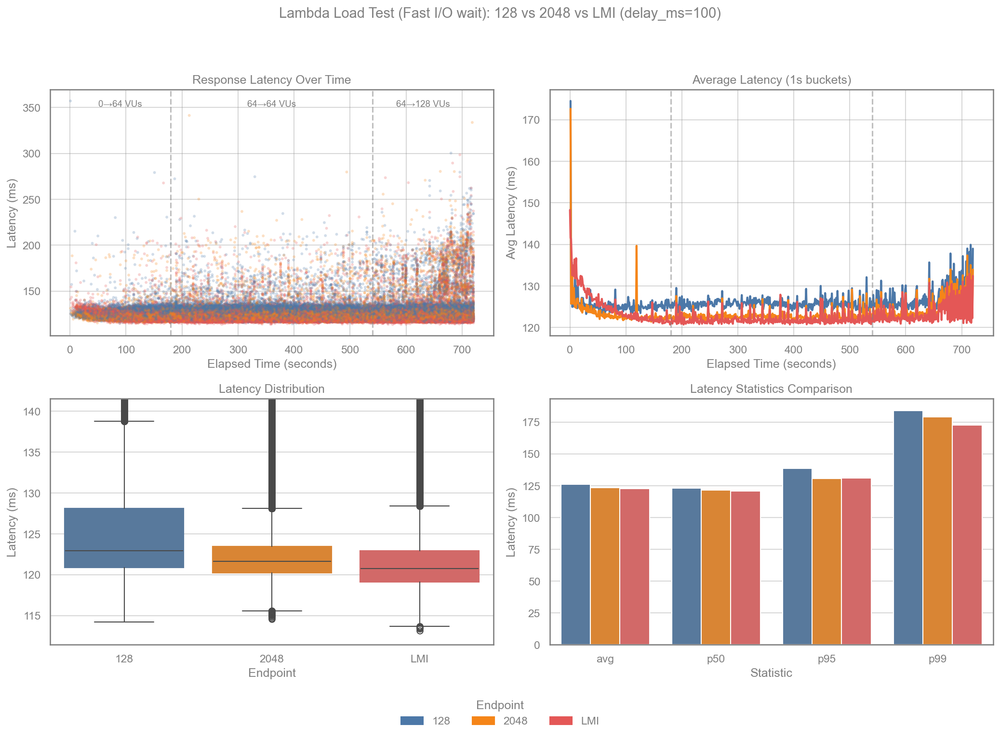
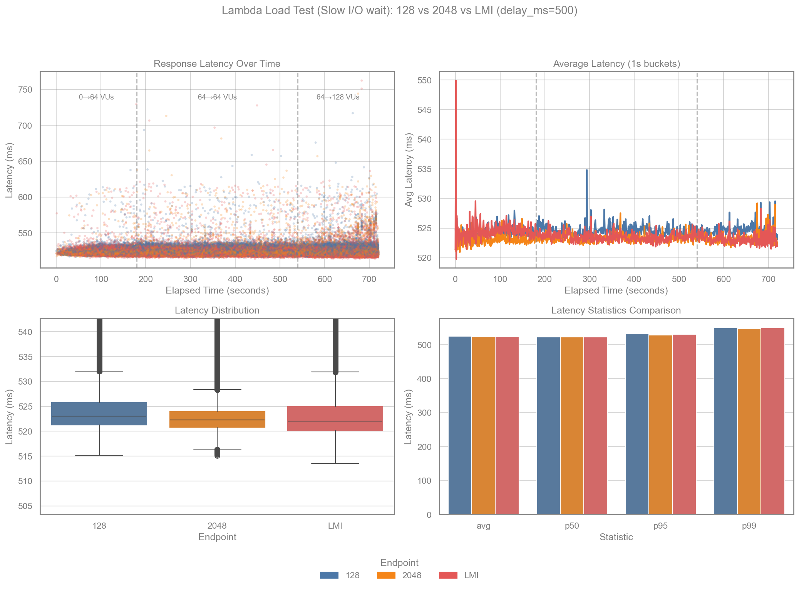
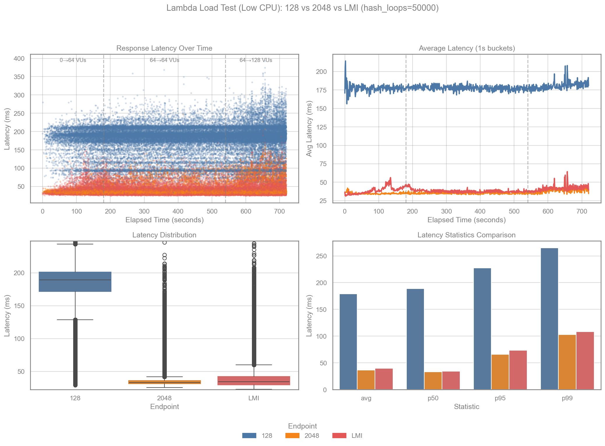
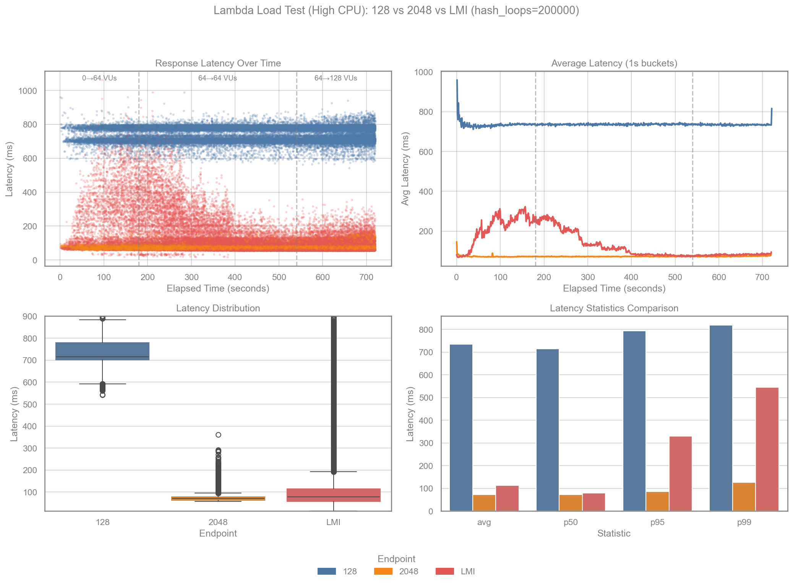
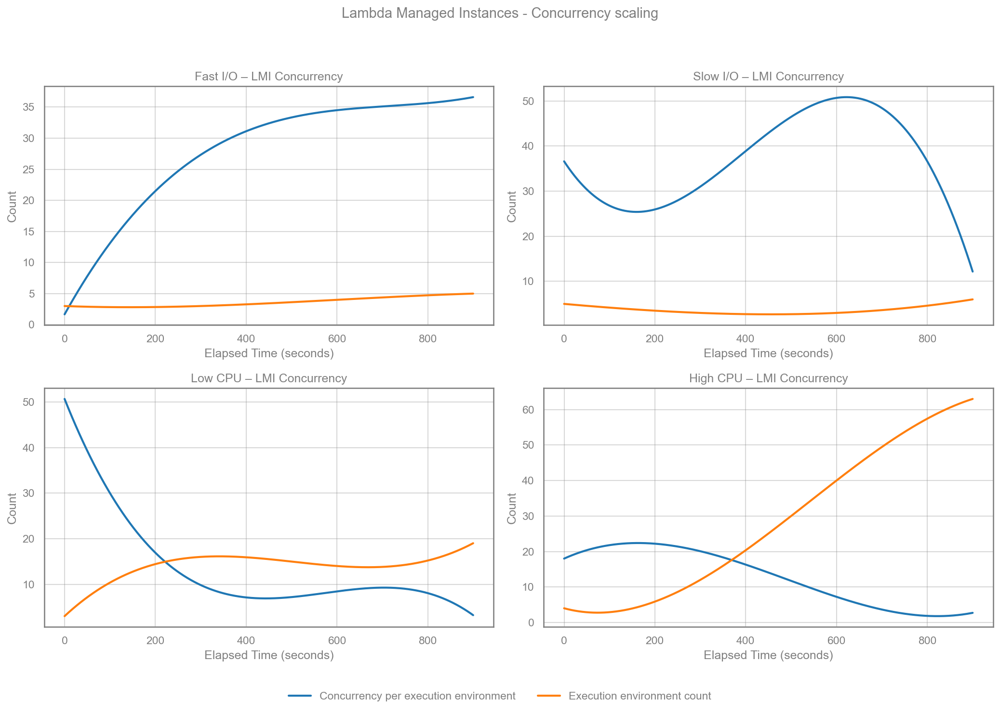

# Rust Lambda Managed Instances (LMI) Demo


A demonstration comparing AWS Lambda with standard execution vs Lambda Managed Instances (LMI) capacity provider, using a Rust-based serverless application.

## Overview

This project deploys three Rust Lambda functions behind API Gateway:

| Endpoint | Memory | Capacity Provider | Description |
|----------|--------|-------------------|-------------|
| `/default/128/hello` | 128 MB | Standard Lambda | Baseline for I/O(wait) workload |
| `/default/2048/hello` | 2048 MB | Standard Lambda | Baseline for CPU workload |
| `/lmi/2048/hello` | 2048 MB | LMI | Lambda Managed Instances with concurrent execution |

The LMI function uses a [forked aws-lambda-rust-runtime](https://github.com/alessandrobologna/aws-lambda-rust-runtime/tree/feat/concurrent-lambda-runtime) that supports handling multiple concurrent requests within a single execution environment.


### LMI Configuration

The LMI Lambda is configured with:
- `ExecutionEnvironmentMemoryGiBPerVCpu: 2` - Memory per vCPU ratio
- `PerExecutionEnvironmentMaxConcurrency: 64` - Up to 64 concurrent requests per execution environment
- Capacity provider instance type: `c8g.xlarge` (arm64)
- Capacity provider subnets: 2 (the first two IDs from `ManagedInstancesSubnetIds`)
- Capacity provider baseline during tests: 2 instances (scale-in target)

## Prerequisites

- [AWS SAM CLI](https://docs.aws.amazon.com/serverless-application-model/latest/developerguide/install-sam-cli.html)
- [Rust](https://rustup.rs/) with [cargo-lambda](https://github.com/cargo-lambda/cargo-lambda)
- [k6](https://k6.io/docs/get-started/installation/) for load testing
- [uv](https://docs.astral.sh/uv/) for running the benchmark script
- AWS account with VPC subnets and security group for LMI

## Deployment

```bash
sam build
sam deploy --guided
```

You'll be prompted for:
- `ManagedInstancesSubnetIds` - VPC subnet IDs for LMI capacity provider
- `ManagedInstancesSecurityGroupId` - Security group ID for LMI

## Load Testing

Run the benchmark to execute all scenarios. Each scenario compares all three endpoints (`/default/128/hello`, `/default/2048/hello`, `/lmi/2048/hello`).

```bash
uv run benchmark.py --stack rust-lmi-demo --scenario all
```

By default, when running `--scenario all`, the script waits between scenarios until the LMI capacity provider scales back to its pre-run EC2 instance count (so each scenario starts from a comparable baseline). Disable with `--no-wait-for-scale-in`.

### Scenarios

| Scenario | `--scenario` | Workload |
|----------|--------------|----------|
| Fast I/O | `fast-io` | `delay_ms=100` |
| Slow I/O | `slow-io` | `delay_ms=500` |
| Low CPU | `low-cpu` | `hash_loops=50000` |
| High CPU | `high-cpu` | `hash_loops=200000` |

### Phases (k6 stages)

Default stages are:
- Ramp-up: `0→64` VUs (3 minutes)
- Steady: `64→64` VUs (6 minutes)
- Ramp-up: `64→128` VUs (3 minutes) — goal is to push until something breaks

The benchmark uses per-endpoint k6 scenarios so a slow endpoint (often `/default/128/hello` on CPU) does not throttle load against the others.
Stage targets apply per endpoint; peak total k6 VUs will be ~3× the target because there are 3 endpoints.

You can override stages with `--stage-targets` (single duration repeated for each target) or `--stages-json` (full control).

### Options

| Option | Default | Description |
|--------|---------|-------------|
| `--stack` | (required) | CloudFormation stack name |
| `--region` | AWS default | AWS region |
| `--duration` | 30s | Duration per k6 stage (only used with `--stage-targets`) |
| `--stage-targets` | (none) | Comma-separated k6 stage targets, e.g. `20,20,40` |
| `--stages-json` | (none) | Full k6 stages JSON (advanced) |
| `--scenario` | all | `fast-io`, `slow-io`, `low-cpu`, `high-cpu`, or `all` |
| `--cpu-low-hash-loops` | 50000 | `hash_loops` used for the Low CPU scenario (max 1,000,000) |
| `--cpu-high-hash-loops` | 200000 | `hash_loops` used for the High CPU scenario (max 1,000,000) |
| `--io-fast-delay-ms` | 100 | `delay_ms` used for the Fast I/O scenario (max 15,000) |
| `--io-slow-delay-ms` | 500 | `delay_ms` used for the Slow I/O scenario (max 15,000) |
| `--output-dir` | `./benchmark-results` | Directory for results |
| `--skip-test` | false | Regenerate charts from existing CSV |
| `--wait-for-scale-in/--no-wait-for-scale-in` | (auto) | Wait between scenarios for LMI scale-in (defaults to on for `--scenario all`) |
| `--capacity-provider-arn` | (derived) | Capacity provider ARN used to find EC2 instances for the wait loop |
| `--scale-in-check-seconds` | 60 | How often to check instance count while waiting |
| `--scale-in-max-minutes` | 90 | Max time to wait for scale-in between scenarios |
| `--cloudwatch-concurrency/--no-cloudwatch-concurrency` | false | Fetch and plot LMI `ExecutionEnvironmentConcurrency` (Average + SampleCount) for each scenario window |
| `--cloudwatch-period-seconds` | 300 | Period (seconds) for CloudWatch concurrency queries |
| `--cloudwatch-function-name` | (derived) | Override CloudWatch FunctionName dimension (default `<stack>-lmi`) |
| `--cloudwatch-resource` | (derived) | Override CloudWatch Resource dimension (default `<function>:$LATEST.PUBLISHED`) |
| `--cloudwatch-capacity-provider-name` | (derived) | Override CloudWatch CapacityProviderName dimension (default `<stack>-cp-2-c8xlarge`) |

## Results

### Benchmark Output

The benchmark writes one CSV + one chart per scenario to `benchmark-results/`.

If `--cloudwatch-concurrency` is enabled, the script writes CloudWatch concurrency charts:
- For a single scenario run: `benchmark-results/cloudwatch-concurrency-<scenario>-<timestamp>.png`
- For `--scenario all`: a combined 2×2 PNG at `benchmark-results/cloudwatch-concurrency-all-<timestamp>.png`

Captured from an m7g.medium EC2 instance in us-east-1 (same region as the APIs) to reduce client-side network variance.
Stages are 3m ramp-up to 64 VUs, 6m steady at 64 VUs, 3m ramp-up to 128 VUs.














### LMI Concurrency Scaling (CloudWatch)



#### Concurrency Notes

- Metric: `ExecutionEnvironmentConcurrency` (Average) with `SampleCount` plotted as a proxy for the number of execution environments reporting in the period.
- Period: 5 minutes (300s), plotted on the same elapsed-time axis as the k6 charts; spline interpolation is used only for readability.
- Fast I/O shows concurrency per environment rising steadily while the (proxy) environment count increases slowly.
- Slow I/O keeps concurrency per environment lower overall, with a gradual environment count increase.
- Low CPU shows concurrency per environment dropping as the environment count increases (scale-out reduces per‑env concurrency).
- High CPU shows the most aggressive scale-out: environment count ramps sharply while concurrency per environment declines.

### Notes

- CPU-heavy work does not benefit from high per-environment concurrency. With `ExecutionEnvironmentMemoryGiBPerVCpu: 2` and a 2 GB function, each execution environment gets ~1 vCPU; allowing up to `PerExecutionEnvironmentMaxConcurrency: 64` means CPU-bound requests contend for that vCPU.
- Lambda managed instances capacity providers scale gradually; AWS docs say they maintain enough headroom for traffic to double within 5 minutes. If traffic increases faster than this, requests can be throttled. ([AWS docs](https://docs.aws.amazon.com/lambda/latest/dg/lambda-managed-instances-scaling.html))
- Over time, Slow I/O stays effectively flat across stages (p99 ~539→542→556 ms). Fast I/O is flat through stage 2 and shows a modest tail rise in stage 3 (p99 ~152→166→197 ms) as VUs ramp to 128. Low CPU shows a tail increase in stage 3 across all endpoints; it’s most pronounced (relative to baseline) for 2048/LMI. High CPU is the most sensitive: 128 stays saturated and flat, 2048’s tail grows in stage 3 (p99 ~94→110→137 ms), and LMI starts with high tail latency then improves after warm-up/scale-out (p99 ~729→543→210 ms), but still shows a small 5xx rate overall (~0.39%).
- If you don’t wait for LMI scale-in between scenarios, later scenarios will start from a pre-scaled capacity provider and won’t show scale-up/backlog behavior from idle. The benchmark can wait automatically when running `--scenario all` (disable with `--no-wait-for-scale-in`).
- The latency scatter plot is downsampled and the points are shuffled (per endpoint) to reduce overdraw; the CSV contains the full dataset.

## Project Structure

```
rust-lmi-demo/
├── src/main.rs           # Lambda handler
├── Cargo.toml            # Dependencies (uses forked runtime)
├── Cargo.lock            # Cargo lockfile
├── template.yaml         # SAM template
├── loadtest.js           # k6 load test script
├── benchmark.py          # Python orchestration + charting
└── benchmark-results/    # CSV data and PNG charts
```

## How It Works

### Standard Lambda
Each request gets its own Lambda invocation. Under load, AWS scales by creating more execution environments.

### LMI with Concurrent Runtime
The LMI capacity provider, combined with the concurrent Rust runtime, allows a single execution environment to handle multiple requests simultaneously using Tokio's async runtime. This reduces:
- Cold start frequency (fewer environments needed)
- Per-request overhead
- Total Lambda invocations under load

## Cleanup

```bash
sam delete --stack-name rust-lmi-demo
```

## License

MIT
